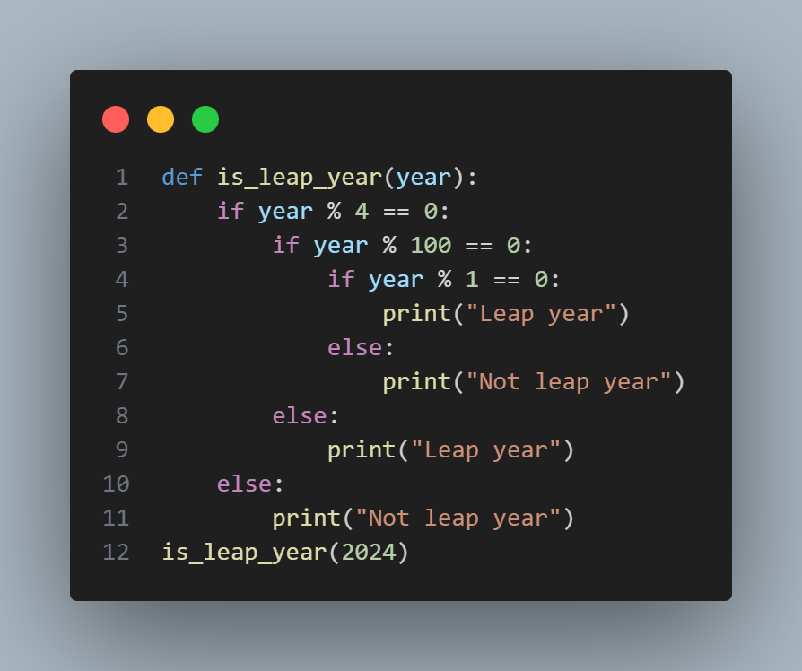

# Leap-year-checker

There isn't much code in creating a leap-year-checker. You just need to follow these steps:

1. Create a def() function, then put in a function(is_leap_year), put in a  parameter in the function(is_leap_year(year)). Create an if statement of(if year % 4 == 0: pass), then pass(pass). Create an else statement to print(print("Not leap year")) 
2. Clear the pass under the if statement, then create an if statement of if(year % 100 == 0), then pass again, and put an else statement to print(print("Leap year")). Clear the pass under the second if statement, then create another if statement of if(year % 1 == 0:print("Leap year")), then create an else statement to print(print("Not leap year")). Print out all the code by typing the function(is_leap_year)

Thats all for the leap-year-checker, if you don't understand look at the image;